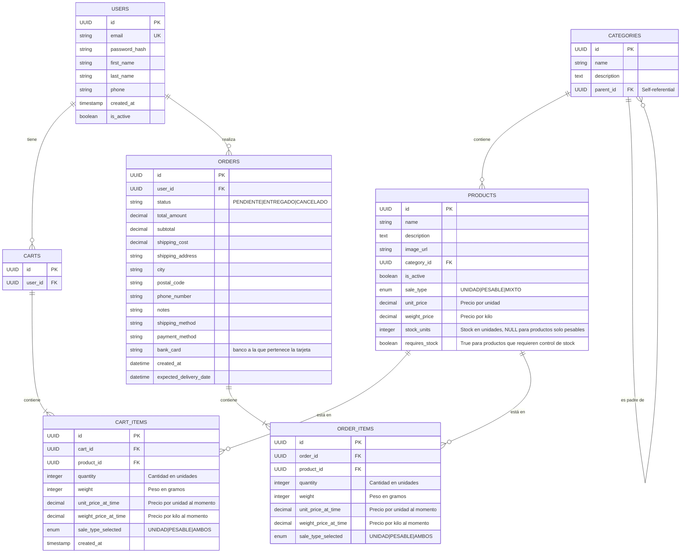

# El Puesto - Documentación

## Descripción
MVP para el supermercado El Puesto. Este proyecto incluye una aplicación web con frontend en React (Vite) y backend en FastAPI.

## Estructura del Proyecto
```
PaginaWebElpuesto/
├── frontend/                 # React (Vite)
│   ├── src/
│   │   ├── assets/         # Imágenes, iconos, etc.
│   │   ├── components/     # Componentes reutilizables
│   │   │   ├── common/    # Botones, inputs, etc.
│   │   │   └── layout/    # Header, Footer, etc.
│   │   ├── pages/         # Páginas principales
│   │   ├── services/      # Servicios para llamadas a la API
│   │   └── App.jsx
│   └── package.json
│
├── backend/                 # FastAPI
│   ├── app/
│   │   ├── api/           # Endpoints de la API
│   │   ├── models/        # Modelos de datos
│   │   ├── config.py      # Configuración
│   │   └── main.py        # Aplicación principal
│   ├── requirements.txt
│   └── .env               # Variables de entorno
│
└── docs/                   # Documentación del proyecto
```

## Tecnologías Utilizadas
- Frontend: React con Vite
- Backend: FastAPI
- Base de datos: PostgreSQL

## Diagrama de Clases

