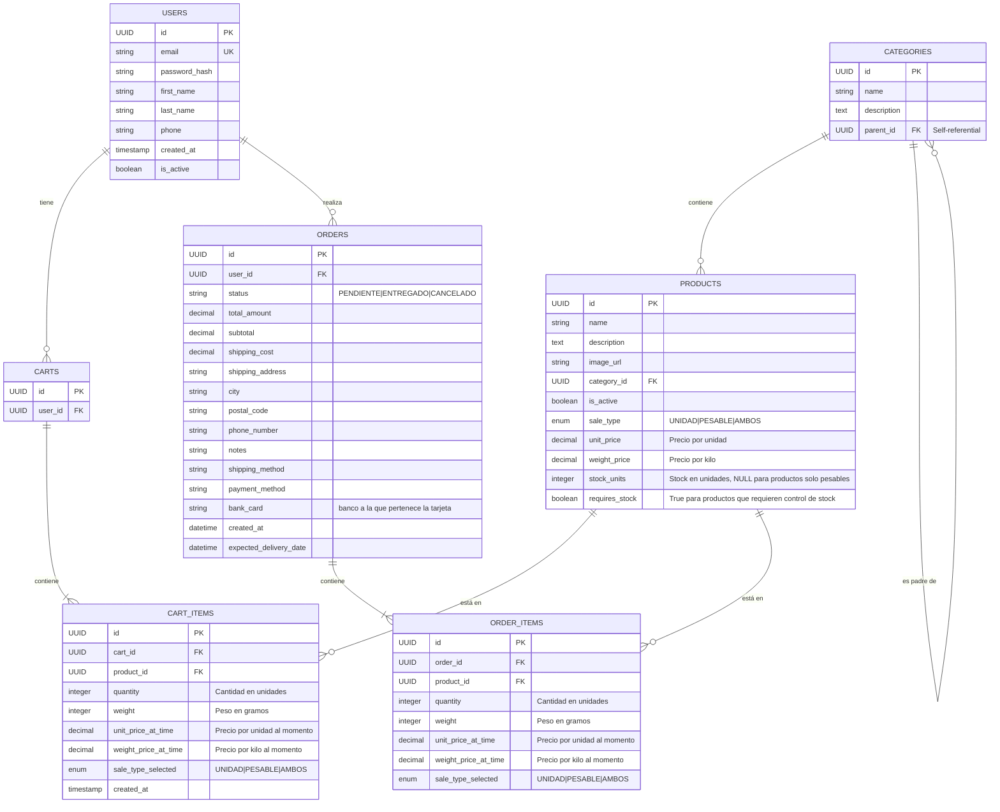

# Diagrama de Base de Datos - El Puesto

## Diagrama de Clases

## Detalles de Implementación

### Tipos de Datos
- UUID: Identificadores únicos universales (v4)
- string: VARCHAR(255)
- text: TEXT
- decimal: DECIMAL(10,2) para precios
- integer: INTEGER
- timestamp: TIMESTAMP WITH TIME ZONE
- boolean: BOOLEAN
- enum: ENUM type para estados específicos

### Índices Recomendados
1. USERS:
   - email (UNIQUE)
   - created_at

2. PRODUCTS:
   - category_id
   - name (para búsquedas)
   - created_at

3. CARTS:
   - user_id

4. ORDERS:
   - user_id
   - status
   - created_at

5. CART_ITEMS & ORDER_ITEMS:
   - product_id
   - cart_id/order_id

### Restricciones
1. Productos:
   - price > 0
   - stock >= 0
   - category_id NOT NULL

2. Cart Items:
   - quantity > 0
   - price_at_time > 0

3. Order Items:
   - quantity > 0
   - price_at_time > 0

4. Orders:
   - total_amount >= 0

### Triggers Necesarios
1. Actualizar total_amount en ORDERS cuando se modifican ORDER_ITEMS
2. Verificar stock antes de crear ORDER_ITEMS
3. Actualizar stock cuando una orden es completada
4. Cancelar órdenes PENDING expiradas

### Consideraciones de Seguridad
1. Encriptación para datos sensibles
2. Soft delete para registros importantes
3. Auditoría de cambios en órdenes
4. Validación de estados de orden
5. Control de concurrencia para stock